# MineMesh

**MineMesh** is an underground mine-worker safety system built around two ESP32-C3 firmwares that share a single JSON protocol. A wearable **worker** device senses motion, battery, and emergency inputs, then sends compact Protocol v1 packets over **ESP-NOW**. A nearby **gateway** receives those packets, shows live status on a local web page, and can optionally bridge the **exact same JSON** onto MQTT for systems outside the mine.

This repository contains the hardware firmwares and the shared protocol. It is the source of truth for what the devices do today. A separate laptop dashboard or mobile app is not included here; because the gateway already exposes a stable MQTT uplink, those clients can be added later without changing the on-device packet format.

Timers, peer MAC/channel, gateway mode, MQTT broker/topic, device identity, and mesh hop fields (`ttl` / `hop_count`) are **configurable**, so the same firmware pair can be retuned for different shaft layouts and used as a building block when planning larger mesh deployments.

### High-level architecture

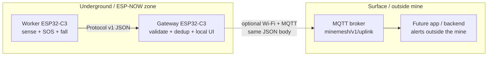

```text
[Worker ESP32-C3]  --ESP-NOW Protocol v1 JSON-->  [Gateway ESP32-C3]
                                                      |
                                      optional Wi-Fi + MQTT publish
                                                      |
                                                      v
                                         topic: minemesh/v1/uplink
                                                      |
                          future app / backend can subscribe and show alerts
                          to supervisors outside the mine
```

---

## Why this helps mine workers

Underground sites often have poor or no cellular coverage, limited visibility between crews, and delays before anyone notices that a worker is hurt, trapped, or unresponsive. MineMesh puts a small safety radio on the worker and a bridge near a network edge so help can start sooner.

| Worker risk | What MineMesh does |
|---|---|
| Explicit emergency | Long-press SOS button → `SOS` with `reason: MANUAL_SOS` |
| No movement / possible collapse | After ~60s without meaningful IMU motion → `SOS` with `reason: INACTIVITY` |
| Fall / impact | MPU6050 spike → fall handling and `FALL_ALERT` |
| Local awareness | Buzzer + RGB LED so the worker gets immediate feedback even before a surface UI reacts |
| Battery health | Telemetry includes battery percentage from ADC |
| Link quality | Gateway tracks RSSI and last-seen so a fading or offline worker is visible |

Safety logic runs **on the worker device**. The worker does not need continuous internet. The gateway only needs to be in ESP-NOW range; when Wi-Fi + MQTT mode is enabled, the same alerts can leave the mine shaft to a broker that surface apps can listen to.

---

## Why it is cost-friendly

MineMesh is intentionally built from low-cost, commodity parts and radio modes that avoid per-worker cellular or proprietary mesh licenses.

1. **Cheap end devices** — Each worker is an ESP32-C3 plus an MPU6050, button, buzzer, LED, and simple battery sense. That is far cheaper than industrial intrinsic-safety radios or LTE wearables for every person underground.
2. **ESP-NOW instead of cellular per helmet** — Workers talk short-range radio to a gateway. You do not pay for SIMs, data plans, or satellite links on every worker just to get heartbeat and SOS out of a local zone.
3. **One gateway, many workers** — The gateway firmware tracks up to **16** validated worker IDs. Adding another worker is mostly another low-cost node, not another full backhaul stack.
4. **Works offline for local ops** — Default gateway mode is **AP + ESP-NOW receive only**. Supervisors can join `MineMesh-Gateway` and open the built-in dashboard at `http://192.168.4.1` with no cloud subscription.
5. **Optional MQTT only when you need surface reach** — Switch the gateway into Wi-Fi + MQTT bridge mode when you want uplink. The broker can be a free/local Mosquitto instance; you are not locked into a paid device platform.
6. **One protocol everywhere** — Worker → gateway → MQTT uses the same UTF-8 JSON envelope (`PROTOCOL.md`). No duplicate parsers, no vendor SDK tax, easier future apps.
7. **Hackathon / MVP hardware, not a full mine certification stack** — The goal is a practical, demonstrable safety loop. Expensive certification, multi-hop mesh routers, and heavy server infrastructure are intentionally out of scope for this firmware set.

---

## Repository layout

```text
my_firmware/
├── PROTOCOL.md          # Shared MineMesh Protocol v1 (source of truth for packets)
├── README.md
├── docs/screenshots/    # Gateway dashboard UI captures
├── worker/              # Firmware 1 — end-device / wearable
│   └── firmware/        # App logic, pins, ESP-NOW TX, sensors
├── gateway/             # Firmware 2 — ESP-NOW RX + local UI + optional MQTT bridge
│   ├── README.md
│   └── firmware/
└── blink_led/           # Separate LED blink sample (not part of MineMesh runtime)
```

The two MineMesh images are **separate flashable projects**. Worker sensing code is not merged into the gateway image.

| Firmware | Board | Role |
|---|---|---|
| `worker/` | ESP32-C3 + MPU6050 + SOS + buzzer + RGB LED + battery ADC | Sense, decide SOS/fall, send Protocol v1 over ESP-NOW |
| `gateway/` | ESP32-C3 (Wi-Fi) | Receive ESP-NOW, validate/dedup, local dashboard, optional MQTT publish |

Shared contract: [`PROTOCOL.md`](./PROTOCOL.md).

---

## System overview

### Worker (`worker/`)

ESP-IDF firmware for device id `worker-001` (configurable in `worker/firmware/configs/app_config.h`).

**What it does today:**

- Initializes MPU6050 over I2C (probes `0x68` / `0x69`)
- Reads battery percentage from ADC
- Drives WS2812 status LED and SOS buzzer
- Sends Protocol v1 packets over ESP-NOW to a configured gateway MAC/channel
- Emits:
  - `HEARTBEAT` every **10s** (`status`, `uptime`)
  - `TELEMETRY` every **15s** (`battery`, `rssi`, `firmware_version`, `uptime`)
  - `SOS` on **2s** button hold → `MANUAL_SOS`
  - `SOS` after **60s** inactivity → `INACTIVITY` (re-arms after motion returns)
  - `FALL_ALERT` when a fall spike is detected (current build can alert immediately on suspect for demo/test via `APP_FALL_ALERT_ON_SUSPECT`; a confirm window / short-press cancel path also exists in the loop)

**Worker pin map**

| Function | GPIO |
|---|---:|
| MPU6050 SDA | 4 |
| MPU6050 SCL | 5 |
| MPU6050 address | `0x68` (also probes `0x69`) |
| SOS button (active low, pull-up) | 9 |
| Buzzer | 6 |
| Battery ADC (ADC1 CH0) | 0 |
| On-board RGB LED (WS2812) | 8 |

Avoid ESP32-C3 GPIO 11–17 (flash).

**Gateway peer config** (compile-time in `app_config.h`):

```c
#define APP_GATEWAY_MAC "A0:F2:62:01:17:31"   // copy from gateway serial/AP MAC
#define APP_GATEWAY_CHANNEL 1
```

If the MAC string is invalid, the worker stays in a no-peer state and will not queue ESP-NOW TX.

More detail: [`worker/firmware/README.md`](./worker/firmware/README.md).

### Gateway (`gateway/`)

ESP-IDF ESP32-C3 image with **no** MPU6050 / fall / SOS generation logic. It is a bridge and local operations UI.

**Operating modes** (stored in NVS):

1. **AP + ESP-NOW receive only** (default when Wi-Fi/MQTT is not configured)  
   - SoftAP SSID: `MineMesh-Gateway`  
   - Password: `minemesh` (MVP default — change before any real deployment)  
   - Dashboard: `http://192.168.4.1`  
   - Station Wi-Fi and MQTT stay off until you select bridge mode in the UI

2. **Wi-Fi + MQTT bridge**  
   - Joins site Wi-Fi  
   - Publishes validated uplink packets to MQTT (default topic `minemesh/v1/uplink`)  
   - MQTT body is the **original worker JSON bytes** — not wrapped, renamed, or rewritten

**Gateway behavior:**

- ESP-NOW receive queue
- Full Protocol v1 envelope + payload validation
- Dedup by `message_id`
- Worker status table (up to 16 workers; online window ~30s after last valid packet)
- RAM alert history for `SOS` / `FALL_ALERT` (newest-first, acknowledge clears active flag)
- Critical MQTT retry queue when the broker is temporarily down
- RGB LED status patterns (AP / Wi-Fi / MQTT / RX / SOS / FALL)
- BOOT button (GPIO9) factory-resets gateway NVS config and reboots into setup AP
- Serial CLI: `help`, `status`, `wifi`, `mqtt`, `sniff`, `reboot`

More detail: [`gateway/README.md`](./gateway/README.md) and [`gateway/firmware/docs/overview.md`](./gateway/firmware/docs/overview.md).

### Gateway UI screenshots

Built-in dashboard served by the gateway firmware at `http://192.168.4.1` (SoftAP) or the station DHCP IP after Wi-Fi join. Captures below match that page’s layout (mode config, live workers, RSSI, critical alerts, acknowledge).

| SoftAP setup / waiting for workers | Live worker online |
|---|---|
| 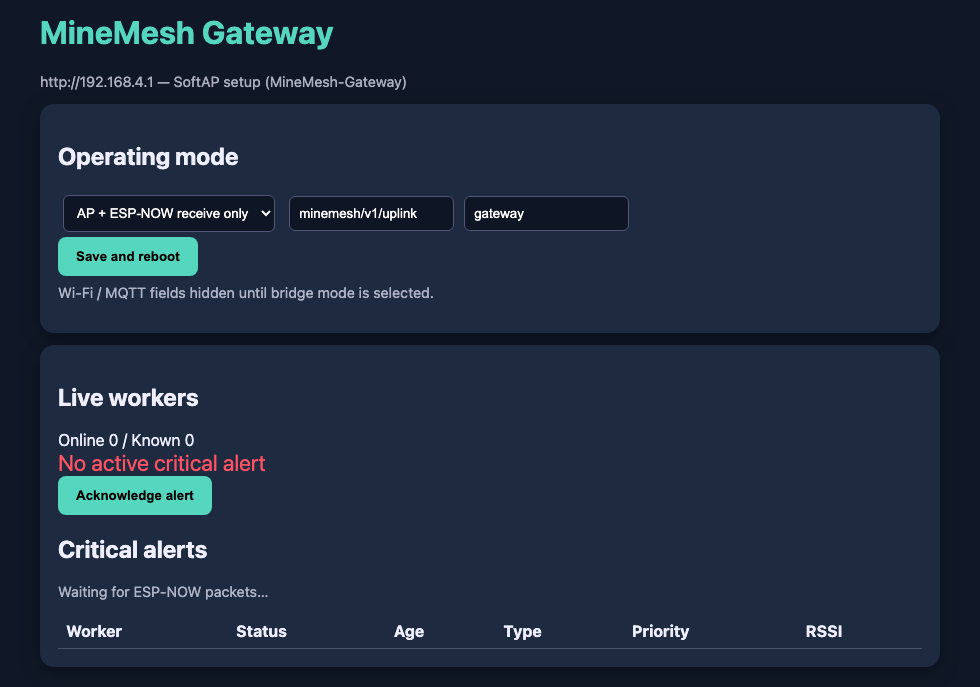 | 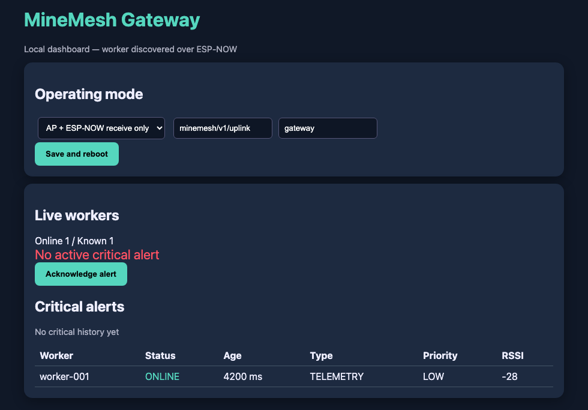 |

| Critical SOS / FALL alerts | Wi-Fi + MQTT bridge config |
|---|---|
| 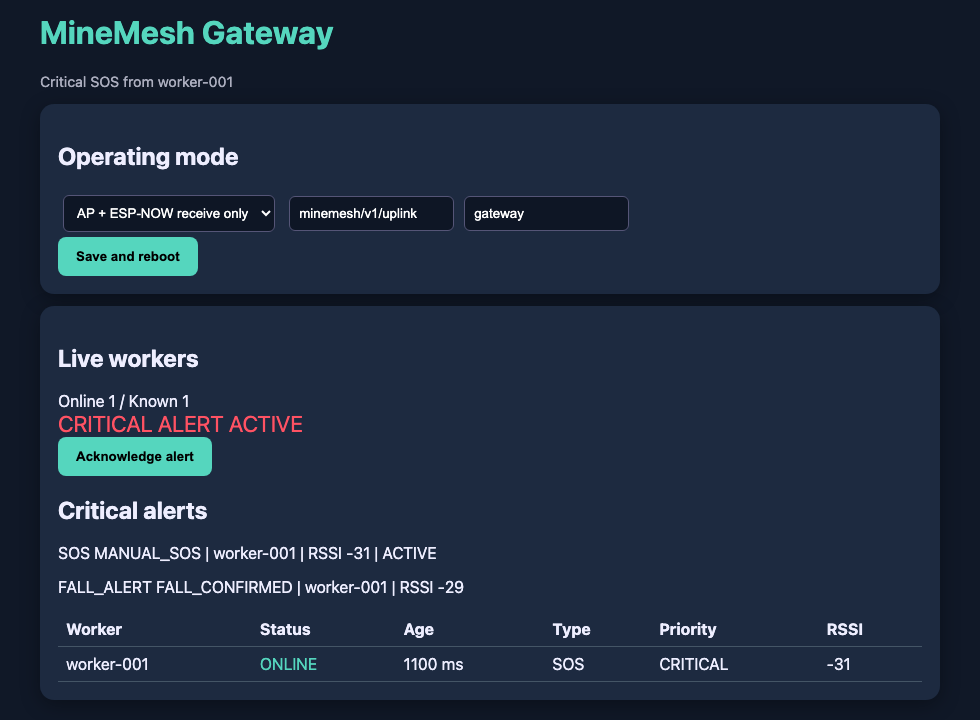 | 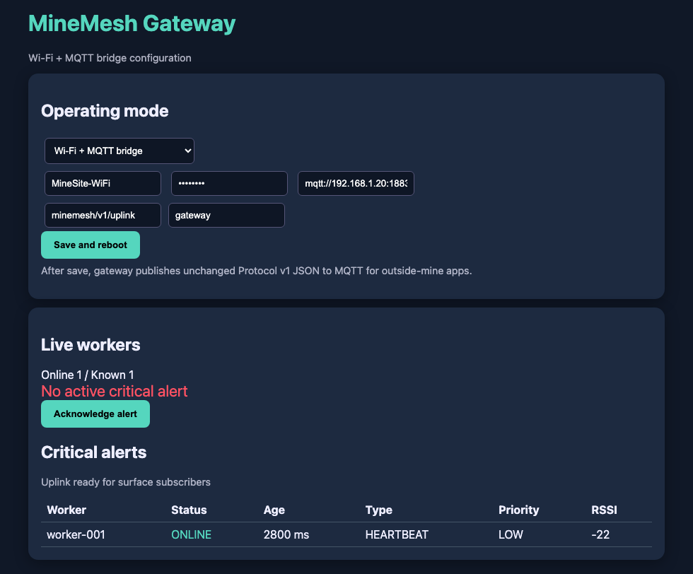 |

- **Setup** — choose AP-only or bridge mode; set topic / `gateway_id`.
- **Workers** — `worker-001` ONLINE with last message type, priority, and RSSI (mesh link quality for planning).
- **Alerts** — `CRITICAL ALERT ACTIVE` with `SOS` / `FALL_ALERT` history and **Acknowledge**.
- **MQTT mode** — enter site Wi-Fi + broker so outside-mine apps can subscribe to `minemesh/v1/uplink`.

Source images: [`docs/screenshots/`](./docs/screenshots/).

---

## Protocol v1 (summary)

Wire format: UTF-8 JSON, one object per packet. Full rules live in [`PROTOCOL.md`](./PROTOCOL.md).

Envelope fields on every packet:

| Field | Notes |
|---|---|
| `protocol_version` | Always `1` |
| `message_id` | Unique per send; used for dedup |
| `source_id` | Worker id, e.g. `worker-001` |
| `destination_id` | Uplink target, e.g. `gateway` |
| `message_type` | `HEARTBEAT` \| `TELEMETRY` \| `SOS` \| `FALL_ALERT` |
| `timestamp` | Unix seconds when available |
| `ttl` / `hop_count` | Hop budget (default ttl `8`) |
| `priority` | `LOW` or `CRITICAL` |
| `payload` | Type-specific object (never omitted) |

**MQTT uplink contract**

- Topic: `minemesh/v1/uplink` (configurable in gateway NVS)
- Body: same Protocol v1 JSON the worker sent
- QoS 1, non-retained (as implemented by the gateway bridge)
- Gateway identity is **not** substituted into `source_id`

Example SOS body:

```json
{
  "protocol_version": 1,
  "message_id": "42",
  "source_id": "worker-001",
  "destination_id": "gateway",
  "message_type": "SOS",
  "timestamp": 0,
  "ttl": 8,
  "hop_count": 0,
  "priority": "CRITICAL",
  "payload": {
    "reason": "MANUAL_SOS",
    "battery": 83,
    "rssi": -62
  }
}
```

Packets are bounded by the ESP-NOW v1 maximum payload (~250 bytes).

---

## Flows

### End-to-end packet path

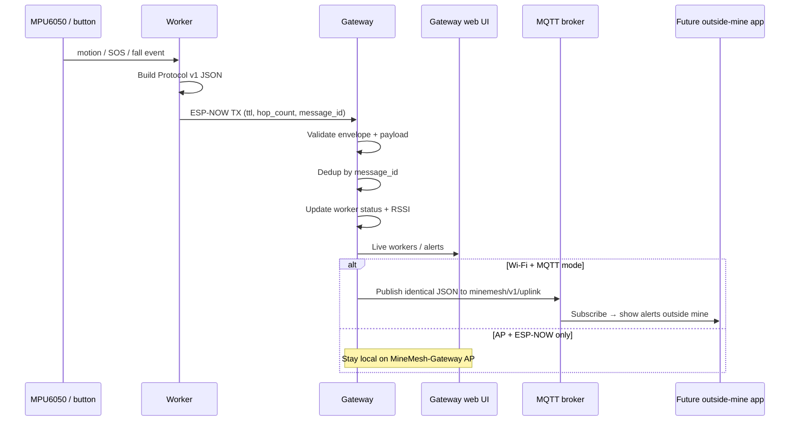

### Worker safety decision flow

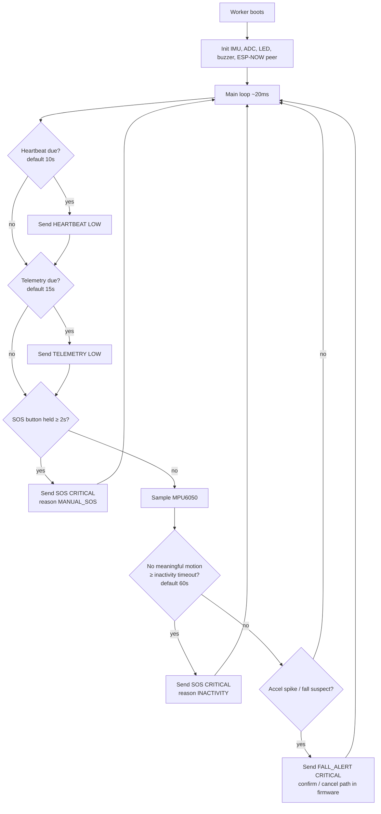

### Gateway processing flow

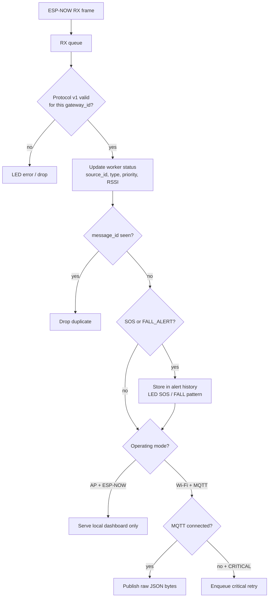

### Path A — Local mine edge (no internet)

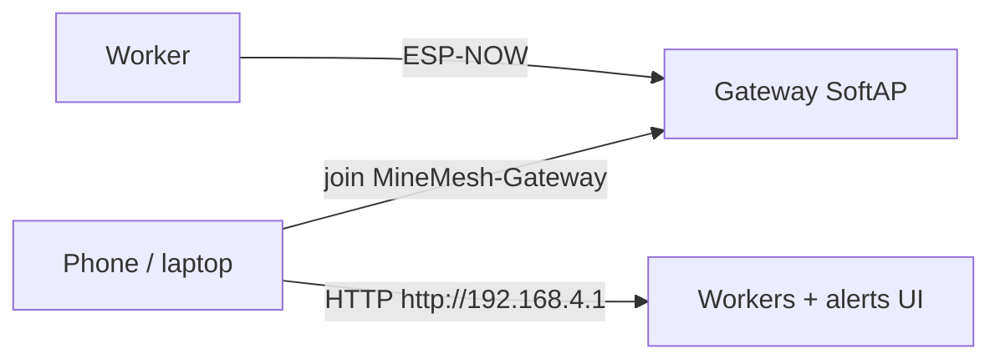

```text
Worker --ESP-NOW--> Gateway AP --HTTP dashboard--> Phone/laptop on MineMesh-Gateway Wi-Fi
```

Useful for demos and for crews that only need alerts near the gateway.

### Path B — Surface / outside-mine apps (MQTT)

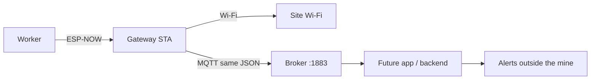

```text
Worker --ESP-NOW--> Gateway (STA Wi-Fi) --MQTT--> Broker --subscribe--> future app / backend
```

Any client that understands Protocol v1 can subscribe to `minemesh/v1/uplink` and render:

- worker online / last seen
- battery and RSSI
- live `SOS` and `FALL_ALERT` banners for supervisors **outside the mine**

That MQTT-facing app is a natural next step; this firmware repo already exposes the uplink contract to support it.

---

## Configurable by design — planning mesh layouts

MineMesh is not a fixed one-off wiring of a single demo. Identity, radio peer, timing, safety thresholds, gateway backhaul, and protocol hop fields are all tunable so you can **plan different mesh / coverage layouts** for different mine zones without inventing a new packet format.

### What you can configure today

| Layer | Configurable knobs | Why it matters for mesh planning |
|---|---|---|
| Worker identity | `APP_DEVICE_ID` (e.g. `worker-001`) | Each wearable is a named node on the map |
| Worker → gateway radio | `APP_GATEWAY_MAC`, `APP_GATEWAY_CHANNEL` | Place workers relative to a specific gateway radio cell |
| Safety timers | heartbeat / telemetry intervals, SOS long-press, inactivity timeout, fall confirm | Tune for quiet drifts vs busy stopes |
| Motion thresholds | motion delta, fall spike / orientation / free-fall `g` values | Adapt sensitivity per role or environment |
| Mesh hop budget | `ttl` (default `8`), `hop_count` on every packet | Protocol already carries multi-hop lifetime; receivers drop when `hop_count >= ttl` |
| Priority | `LOW` vs `CRITICAL` | Plan that SOS/FALL outrank heartbeats under congestion |
| Gateway role | SoftAP local-only vs Wi-Fi + MQTT bridge | Edge-only ops vs surface uplink per shaft entrance |
| Gateway identity / topic | `gateway_id`, `mqtt_broker`, `mqtt_topic_uplink` | Multiple gateways / zones can publish into a planned topic layout |
| Coverage telemetry | per-worker RSSI + last-seen (~30s online window) | Use live link quality to decide where to add gateways or relay points |

Worker knobs live mainly in `worker/firmware/configs/app_config.h`. Gateway knobs are set at runtime via the provisioning web UI / NVS (`mode`, Wi-Fi, MQTT, gateway id).

### How configuration supports mesh plans

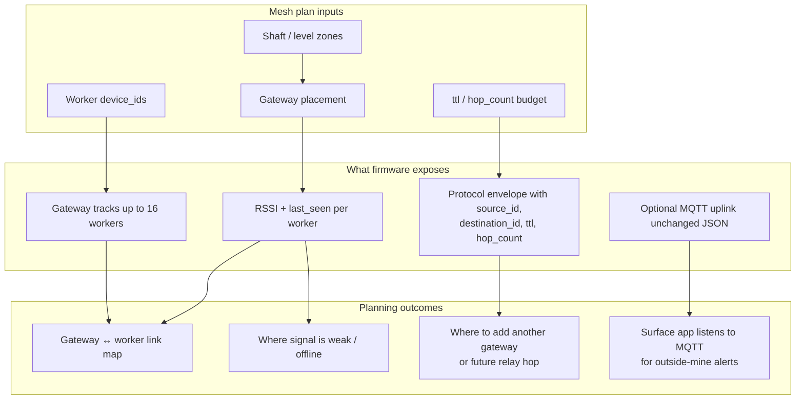

**Practical planning model (MVP today):**

1. Treat each **gateway** as a radio cell / mesh root for a zone (entrance, refuge bay, staging point).
2. Assign each **worker** a unique `source_id` and point it at that gateway’s MAC + channel.
3. Watch **RSSI + last-seen** on the gateway dashboard to see who is online and which links are marginal.
4. Use envelope fields (`destination_id`, `ttl`, `hop_count`, `message_id` dedup, `priority`) as the contract for growing from today’s **direct worker → gateway** hop into larger mesh plans later (additional gateways, relays, or multi-zone MQTT consumers) **without changing the JSON schema**.

```text
                    planned zone A                         planned zone B
                 ┌──────────────────┐                   ┌──────────────────┐
  worker-001 ───►│ gateway-A        │──MQTT──┐     ┌───►│ gateway-B        │
  worker-002 ───►│ RSSI / last_seen │        │     │    │ RSSI / last_seen │
                 └──────────────────┘        ▼     │    └──────────────────┘
                                        MQTT broker ┤
                                             │     │
                                             └─────┘
                                   outside-mine apps subscribe
                                   and render multi-zone alerts
```

Today’s showcase focuses on **one worker + one gateway** (one hop). The protocol and config surfaces are intentionally general so the same system can be used to draft and evolve mesh coverage plans as you add workers, gateways, and surface listeners.

---

## Build and flash

Requires ESP-IDF (projects target **ESP32-C3**).

### Worker

```bash
cd worker
idf.py set-target esp32c3
idf.py build
idf.py -p <PORT> flash monitor
```

Set `APP_GATEWAY_MAC` and `APP_GATEWAY_CHANNEL` in `worker/firmware/configs/app_config.h` to the values printed by the gateway.

### Gateway

```bash
cd gateway
idf.py set-target esp32c3
idf.py build
idf.py -p <PORT> flash monitor
```

On first boot (or after BOOT-button reset), join `MineMesh-Gateway` / `minemesh` and open `http://192.168.4.1` to configure mode, Wi-Fi, and MQTT.

For Path B, run a local broker (for example Mosquitto on `mqtt://<lan-ip>:1883`) and point the gateway at it.

---

## Quick demo checklist

1. Flash gateway, note AP MAC + channel from serial logs.
2. Set worker `APP_GATEWAY_MAC` / `APP_GATEWAY_CHANNEL`, flash worker.
3. Join `MineMesh-Gateway` and open the gateway dashboard.
4. Confirm `worker-001` appears with heartbeat/telemetry and RSSI.
5. Long-press SOS → critical alert on gateway UI / LED.
6. Trigger inactivity or fall → corresponding alert reason/type.
7. Acknowledge alert on the gateway page.
8. (Optional) Switch gateway to Wi-Fi + MQTT bridge and confirm identical JSON on `minemesh/v1/uplink`.

---

## Configuration reference

Use these knobs when retuning a single cell or when drafting a multi-zone mesh plan (see [Configurable by design](#configurable-by-design--planning-mesh-layouts)).

### Worker (`app_config.h`)

| Key | Default in repo | Planning note |
|---|---|---|
| `APP_DEVICE_ID` | `worker-001` | Unique node name on the mesh map |
| `APP_FIRMWARE_VERSION` | `1.0.0` | Appears in telemetry |
| `APP_HEARTBEAT_INTERVAL_SEC` | `10` | Online freshness / airtime tradeoff |
| `APP_TELEMETRY_INTERVAL_SEC` | `15` | Battery + RSSI sampling rate |
| `APP_SOS_LONG_PRESS_MS` | `2000` | Accidental-press vs fast SOS |
| `APP_FALL_CONFIRM_SEC` | `10` | Confirm window before / around fall send |
| `APP_INACTIVITY_TIMEOUT_SEC` | `60` | Unresponsive-worker timeout |
| `APP_TTL_DEFAULT` | `8` | Max hop lifetime for mesh growth |
| `APP_GATEWAY_CHANNEL` | `1` | Must match gateway radio cell |
| `APP_GATEWAY_MAC` | board-specific; must match gateway | Which gateway this worker joins |

Also tunable in the same header: motion / fall `g` thresholds (`APP_MOTION_DELTA_G`, `APP_FALL_SPIKE_G`, etc.).

### Gateway NVS (`gateway` namespace)

| Key | Purpose | Planning note |
|---|---|---|
| `mode` | AP+ESP-NOW vs Wi-Fi+MQTT | Local cell vs surface-linked cell |
| `wifi_ssid` / `wifi_password` | Station credentials | Which site network feeds the broker |
| `mqtt_broker` | e.g. `mqtt://192.168.1.20:1883` | Where outside-mine apps subscribe |
| `mqtt_topic_uplink` | default `minemesh/v1/uplink` | Topic layout for multi-gateway plans |
| `gateway_id` | default `gateway` | Logical mesh root / zone id |

Credentials are not committed. Provision through the web UI or your own NVS workflow. Press BOOT (GPIO9) to wipe gateway NVS and return to the setup AP when relocating a node in a mesh plan.

---

## Future direction (not in this repo yet)

Because the gateway already publishes a clean MQTT stream of Protocol v1 packets, a natural follow-on is an **app or backend that listens to the exposed MQTT topic** and shows alerts to supervisors outside the mine — phone push, control-room dashboard, or SMS bridge — without redesigning the worker firmware.

The same stream plus `source_id` / RSSI / `ttl` / `hop_count` can feed a **mesh planning view**: place gateways, assign workers to radio cells, and highlight weak or offline links before expanding coverage.

Possible later additions (not claimed as implemented here):

- Multi-hop worker-to-worker relay polish using the existing `ttl` / `hop_count` contract
- Round-trip alert acknowledgement back to the wearable
- Additional sensors behind a cleaner sensor interface
- Hardened provisioning / credential security for production mines

---

## Out of scope for this firmware set

- Production mining certification / intrinsic safety approval
- Running an MQTT broker on the ESP32 itself
- Continuous raw IMU streaming to the gateway
- Full enterprise auth, multi-tenant cloud, or PostgreSQL backends inside this repo

---

## Docs map

| Doc | Contents |
|---|---|
| [`PROTOCOL.md`](./PROTOCOL.md) | Envelope, payloads, MQTT uplink rules |
| [`docs/screenshots/`](./docs/screenshots/) | Gateway UI screenshots used in this README |
| [`worker/firmware/README.md`](./worker/firmware/README.md) | Worker pins, intervals, build |
| [`gateway/README.md`](./gateway/README.md) | Gateway flash, provisioning, MQTT contract, LED meanings |
| [`gateway/firmware/docs/overview.md`](./gateway/firmware/docs/overview.md) | Runtime notes from verified ESP-NOW reception |

---

## License / hackathon note

Built as an AI Hardware Hackathon MVP: two flashable firmwares, one shared protocol, local safety UX on the gateway, and an MQTT path ready for outside-mine alert clients.
