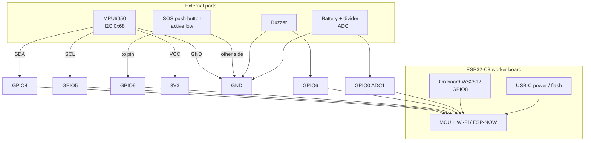
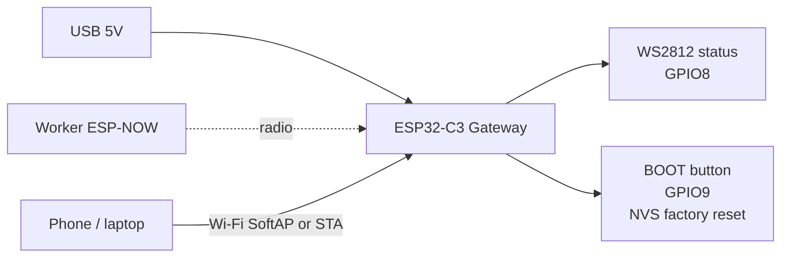

# MineMesh — Board & sensor wiring

Connection guide for the **worker** (ESP32-C3 + MPU6050 + SOS + buzzer + battery sense) and **gateway** (ESP32-C3 only). GPIO numbers match the firmware configs.

Full parts list: [`../BOM.md`](../BOM.md).

---

## Worker — sensor & peripheral hookup



### Pin → part table

| ESP32-C3 pin | Direction | Connects to |
|---|---|---|
| **3V3** | Power out | MPU6050 `VCC` (and buzzer VCC if 3.3 V module) |
| **GND** | Ground | MPU6050 `GND`, button return, buzzer GND, battery divider GND |
| **GPIO4** | I2C SDA | MPU6050 `SDA` |
| **GPIO5** | I2C SCL | MPU6050 `SCL` |
| **GPIO9** | Digital in (pull-up) | SOS button → other side to `GND` |
| **GPIO6** | Digital out | Buzzer signal (or transistor base via 1k) |
| **GPIO0** | ADC in | Mid-point of battery voltage divider |
| **GPIO8** | RMT / LED | On-board WS2812 (usually already wired on DevKit) |

### MPU6050 detail

```text
                    ESP32-C3                 MPU6050 module
                 +------------+            +--------------+
          3V3 ---| 3V3        |            | VCC          |
          GND ---| GND        |------------| GND          |
                 | GPIO4 SDA  |------------| SDA          |
                 | GPIO5 SCL  |------------| SCL          |
                 |            |            | AD0 -> GND   |  (addr 0x68)
                 |            |            | XDA/XCL n/c  |
                 +------------+            +--------------+
```

- Keep I2C wires short on a breadboard.
- Firmware also probes `0x69` if AD0 is high.
- Do not use GPIO 11–17 on ESP32-C3 (connected to flash).

### SOS button

```text
  GPIO9 -----+---- tactile switch ---- GND
             |
        (internal pull-up in firmware)
```

Long-press ≥ 2 s → `SOS` / `MANUAL_SOS`. Short press can cancel an active fall countdown.

### Buzzer

```text
  GPIO6 ---- signal ---- active buzzer ---- GND
```

If the buzzer draws more than a few mA, drive it with an NPN (GPIO6 → 1k → base; collector to buzzer low side; emitter GND; buzzer other side to 3V3/5V as rated).

### Battery sense (ADC)

```text
  BAT+ -- R1 --*-- R2 -- GND
               |
            GPIO0 (ADC)
```

Choose R1/R2 so the voltage at GPIO0 stays **≤ 3.3 V** at max battery voltage. Firmware maps ADC raw → rough 0–100% battery in telemetry.

---

## Gateway — board connections

The gateway has **no MPU6050**. USB power is enough.



| Function | GPIO / interface |
|---|---|
| Status RGB LED | GPIO8 (on-board) |
| BOOT / config reset | GPIO9 (on-board) |
| Power / flash | USB |
| Worker link | ESP-NOW (same channel as worker) |
| Local UI | SoftAP `MineMesh-Gateway` → `http://192.168.4.1` |
| Optional uplink | Station Wi-Fi + MQTT |

Copy the gateway MAC + channel from serial logs into the worker's `APP_GATEWAY_MAC` / `APP_GATEWAY_CHANNEL`.

---

## End-to-end physical layout

```text
   +-------------------------+         ESP-NOW          +----------------------+
   | WORKER                  | ....................... > | GATEWAY              |
   | ESP32-C3                |                          | ESP32-C3             |
   |  +- MPU6050 (I2C)       |                          |  +- USB power         |
   |  +- SOS button          |                          |  +- RGB LED           |
   |  +- Buzzer              |                          |  +- SoftAP / MQTT     |
   |  +- Battery ADC         |                          +----------+-----------+
   +-------------------------+                                     |
                                                                   v
                                                        Phone dashboard / MQTT broker
```

---

## Quick checklist before power-on

1. MPU6050 on **3V3 / GND / GPIO4 / GPIO5**, AD0 for `0x68`
2. SOS button between **GPIO9** and **GND**
3. Buzzer on **GPIO6** (safe drive current)
4. Battery divider into **GPIO0** only if sensing battery (optional for USB-only demo)
5. Gateway powered over USB; note MAC + channel for worker config
6. Avoid GPIO 11–17 on both boards
